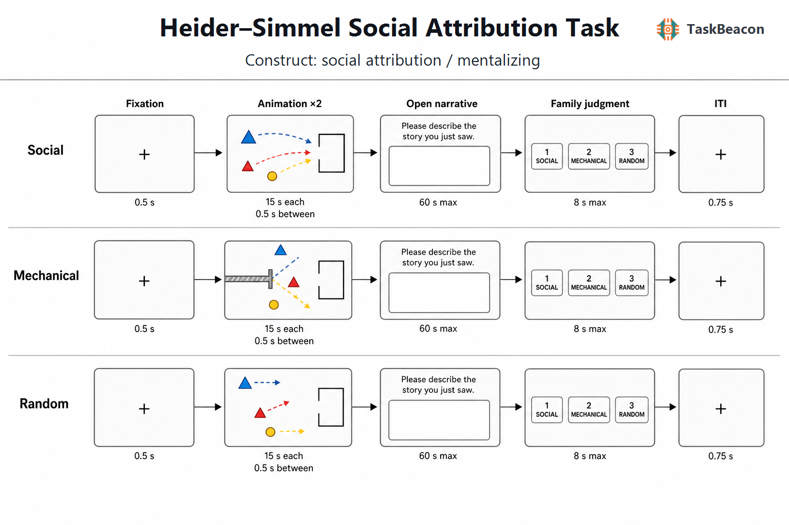

# 从运动线索到社会归因：Heider–Simmel 社会归因任务的理论、方法与测量边界

人类能够依据极为稀疏的运动信息判断一个物体是否具有生命性、目标和意图，并进一步把多个物体之间的时空关系组织成社会事件。该能力构成社会知觉与心智化（mentalizing）的重要基础，也提出了一个持续至今的方法学问题：观察者赋予运动以社会意义，究竟依赖局部运动学线索、对象间的关系结构，还是对完整事件的高阶解释？Heider–Simmel 社会归因任务（Heider–Simmel social attribution task）以没有面孔、身体和语言的几何图形为刺激，使社会意义主要由自发运动、追逐、相互响应、目标受阻及情境连续性产生，因而可在降低人物外观和语义材料影响的同时考察社会归因。但“去人物化”并未消除一般视觉加工、注意、叙事整合和语言表达的贡献；这些成分决定了该范式的理论价值，也限定了其测量解释。

## 1. 范式提出与理论背景

Heider 与 Simmel（1944）制作了一段约 2.5 分钟的无声动画，其中两个三角形、一个圆形和一个矩形围栏构成追逐、冲突、逃离等事件。实验一的 34 名观察者中仅一人主要采用几何描述，其余参与者均以人物、行动或心理状态组织叙事；倒放动画仍能引发拟人化描述，但叙事一致性降低。该结果说明社会归因并非只能由面孔或生物形态触发，事件的时间组织以及各对象动作之间的依存关系同样提供关键线索。原研究使用完整影片与开放叙事，测量的是在未提示类别时自发生成社会意义的倾向，尚不是具有标准试次、固定对照和客观计分的能力测验。

后续发展形成了两条相互关联的路线。Klin（2000）把原影片分段并建立社会归因任务（Social Attribution Task, SAT）的叙事编码体系，量化社会要素识别、心理状态词、人格归因及与情节的相关性。Abell、Happé 与 Frith（2000）则制作 12 段双三角动画，每类四段，分别呈现随机运动、简单目标导向互动和需要参照另一对象心理状态才能解释的心智化情节。后者通常称为 Frith–Happé 动画任务，其分级条件使“检测自主运动”“识别目标导向互动”与“推断隐含心理状态”获得了可比较的操作定义。White 等人（2011）进一步采用三分类判断以缩短施测并提高计分客观性；后续网络版本将观看后的动画类别和心理状态判断转为远程客观评分，从而降低转录与人工编码负担（Livingston et al., 2021）。这些版本共享几何运动刺激，却不具有完全相同的构念含义：原版 SAT 强调自发叙事，Frith–Happé 条件强调随机—目标导向—心智化的分级，而社会—机械对照更直接检验同类图形运动被组织为社会事件还是物理事件（Martin & Weisberg, 2003）。

## 2. 任务逻辑、流程与核心指标

现代动画范式的基本试次由注视或基线、动画呈现、反应和试次间隔构成。刺激通常包含两个或多个几何对象；随机条件使对象独立漂移或碰撞，目标导向条件通过追逐、引导或共同动作建立可见目标，心智化条件再加入欺骗、劝诱、惊讶等需要推断不可见心理状态的情节。社会—机械版本则以协助、阻碍或共同游戏等相互依存运动对比碰撞、弹跳和传送等物理因果运动。动画时长、是否重播、反应提示及基线选择随研究目的变化，因此不存在可脱离版本而通用的固定时序。

开放叙事和强迫选择测量不同过程。开放提问若在类别标签之前出现，能够保留社会意义是否自发进入描述、心理状态词是否恰当以及情节是否整合等信息；其主要因变量包括叙事相关性、社会要素数量、意向性或心智化评分、心理状态词频和反应时。该测量依赖语言能力、叙事长度与编码规则，跨语言研究需预先规定词典或人工编码手册并报告评分者一致性。三分类正确率及反应时更易标准化，却在选项出现后测量显式类别辨别；正确选择“社会”不能单独证明参与者在观看时自发推断了信念或情绪。重复播放可降低记忆负荷（Ratajska et al., 2020），同时也给观察者更多机会形成情节，并可能增强社会解释。

各条件对比还包含可识别性限制。“心智化 > 随机”同时改变运动协调、目标结构、事件复杂度与可叙述性；“社会 > 机械”减少了是否互动这一差异，却仍可能在速度、加速度、接近距离、碰撞次数和情绪效价上不匹配。Malik 与 Isik（2023）利用大规模程序化动画表明，人类社会互动判断依赖对象之间的关系表征，而不只是单个对象的外观或轨迹；这支持以成对关系为核心的解释，也要求研究者量化低级运动特征并设置非社会互动对照。若任务仅包含追逐、协助等可见目标事件，将得分命名为社会归因或互动识别比直接命名为“信念心智化”更准确。

## 3. 主要行为与神经科学发现

### 3.1 社会意义的自发生成与个体差异

Heider–Simmel 效应具有跨刺激延展性。Ratajska、Brown 与 Chabris（2020）制作 32 段 13–23 秒的新动画，参与者在无类别提示下仍自发产生社会和心理属性描述；不同动画引发社会归因的程度存在明显差异，说明刺激本身不是可互换项目。对典型发展个体而言，随机、目标导向和心智化条件通常形成从物理描述到社会—心理描述的梯度；对自闭症群体而言，早期 SAT 与 Frith–Happé 研究报告了较少的相关社会要素和心理状态归因（Abell et al., 2000; Klin, 2000）。

群体差异的规模和特异性需要更审慎的判断。Wilson（2021）汇总 33 项研究、超过 3,000 名自闭症与非自闭症参与者，发现自闭症群体在心智化动画上的差异为中等程度，在目标导向和随机控制条件上也存在较小差异，并检测到发表偏倚。控制条件差异提示一般运动知觉、注意、情境整合或任务理解能够影响所谓心智化效应。由此，动画任务适于检验群体水平的社会归因差异，但单次低分不能据以推断某个个体缺乏“心理理论”，也不能替代临床诊断。

### 3.2 功能影像所揭示的关系加工与心智化网络

早期正电子发射断层成像研究以心智化动画对比随机或目标导向动画。Castelli 等人（2000）发现，心智化条件相对于非社会运动更稳定地招募内侧前额叶、颞顶交界区、颞极及枕外侧视觉区；其后在自闭症与典型组比较中，行为表现、区域活动和功能连接并非总是同步变化（Castelli et al., 2002）。功能磁共振成像（functional magnetic resonance imaging, fMRI）对社会事件与机械事件的直接比较同样显示双侧上颞沟及内侧前额叶等分布式区域的条件差异（Martin & Weisberg, 2003）。跨心智化任务的元分析支持内侧前额叶、颞顶交界区和后内侧皮层的共同参与，但也表明任务形式与心理内容会改变空间分布（Schurz et al., 2014）。

较严格的对照进一步限定了这些活动的含义。Isik 等人（2017）比较帮助/阻碍、两个主体独立活动、无生命物体的物理互动以及单个主体的目标行为，发现后上颞沟的一部分区域对社会互动的存在及类型保持敏感。这一结果表明，部分反应与多主体关系本身相关，不能完全归因于一般生命性或单个目标动作。儿童大型样本研究采用 15 秒社会帮助、社会威胁和随机动画，发现自闭症、注意缺陷多动障碍与典型发展群体在社会—随机及帮助—威胁对比上呈现跨诊断和诊断特异成分；数据驱动亚组跨越传统诊断边界（Vandewouw et al., 2021）。因此，脑成像结果更适合表述为条件相关的网络活动差异，尚不足以把某一脑区视为社会归因的单一因果模块。

现有任务特异神经证据明显以 fMRI 为主。EEG/ERP 研究尚未形成能够稳定对应“随机—目标导向—心智化”阶段的成分体系；持续动画中的线索逐渐累积，事件边界又因情节而异，使时间锁定与条件匹配较困难。高时间分辨率方法若用于该范式，应预先标记转向、接近、阻碍和相互响应等事件，而不宜把整段动画平均活动直接解释为心智化时间进程（Torabian & Grossman, 2023）。

## 4. 范式发展与主要应用

该范式的主要应用已由单一影片的叙事分析扩展至发展、临床、在线测量和计算视觉研究。发展研究利用非人物刺激降低阅读和面孔识别要求，区分儿童对自主运动、目标合理性和不可见心理状态的表征；这些能力随发展并非同时成熟，目标归因早于复杂信念推断（Torabian & Grossman, 2023）。临床研究集中于自闭症，也延伸到注意缺陷多动障碍等群体。Vandewouw 等人（2021）的跨诊断结果提示，与其把动画表现视为疾病专属标记，更合理的做法是同时分析症状维度、年龄、认知能力和行为—脑关系。

方法学发展的另一方向是增加项目数量并减少人工编码。网络化 Frith–Happé 版本提高了施测效率，但自由文本、分类和细粒度项目测验的信度并不等价（Livingston et al., 2021）。Social Shapes Test 以较多短动画和客观选项测量社会智能，远程样本中显示一定的聚合效度和跨群体测量不变性，说明几何动画可发展为标准化项目库（Brown et al., 2024）。程序化生成则能正交操控物理环境、主体目标和关系类型，并用人类判断验证模型表征，为分离运动统计与社会关系提供了比手工少量影片更强的设计空间（Malik & Isik, 2023）。这些扩展与原始 SAT 共享理论渊源，但其分数不可直接互换。

## 5. 测量效度与解释边界

范式具有较好的表面效度和实验效度：极简刺激能够稳定诱发社会叙事，社会、机械和随机条件也可构成明确的操控检验。构念效度则取决于对照。分类正确率可能反映显式规则学习；开放叙事同时受语言产出、记忆和文化脚本影响；社会—随机差异还包含运动协调与情节连贯性。研究设计宜分别报告社会词汇、心理状态词、叙事适切性和分类表现，避免把不同指标合成为未经验证的总分。刺激应先行常模化，并匹配速度、路径长度、接近程度和视觉显著性。

可靠性不能从稳健的组均值效应推导。Altschuler 与 Faja（2022）在 7–11 岁自闭症儿童中发现 SAT 问题解决指数具有良好重测信度，但样本较小，且结论依赖训练后的人工编码。Brown 等人（2024）在另一在线样本中报告 Frith–Happé 12 项分类总分内部一致性偏低，心智化分量表尤其不稳定；较多项目的 Social Shapes Test 仍只达到中等内部一致性和重测相关。由此，少量动画适合实验操控和组间比较，未必足以稳定排列个体。临床或纵向研究需增加项目、使用等值复本、盲法编码并估计评分者一致性、内部一致性和重测信度。现有证据不支持把动画任务单独用于高风险个体决策。

## 6. TaskBeacon 中的任务实现

### 6.1 任务资源与访问入口

| 资源 | ID | 用途 | 地址 |
|---|---|---|---|
| 完整行为实验实现 | T000107 | PsychoPy/PsyFlow 中文行为采集 | https://github.com/TaskBeacon/T000107-heider-simmel-social-attribution-task |
| 浏览器伴随版源码 | H000107 | 与主要流程对齐的网页行为预览 | https://github.com/TaskBeacon/H000107-heider-simmel-social-attribution-task |
| 在线运行入口 | H000107 | 无专用采集硬件的浏览器体验 | https://taskbeacon.github.io/psyflow-web/?task=H000107-heider-simmel-social-attribution-task |

T000107 与 H000107 均标注为中文行为任务，当前成熟度均为 `draft`。H000107 是与本地主要流程对齐的浏览器伴随版，可用于流程体验和浏览器端行为记录；其设备、键盘与运行时环境与本地 PsychoPy 采集不同，不应视为 EEG、MRI 或临床采集版本的等价替代。

### 6.2 实现流程与关键参数

TaskBeacon 当前版本采用 1 个区组、6 个随机排序试次，社会、机械和随机三类各含两个新生成动画。社会类为帮助和追逐/介入，机械类为碰撞反弹和刚性传送，随机类为三个对象相互独立的平滑漂移。各动画包含两个三角形、一个圆形和轮廓围栏；这些刺激并非原始影片或已发表刺激集的复刻。社会类包含可见的目标导向互动，但未单设欺骗或错误信念条件，因此主要结果应解释为社会归因与运动家族辨别，而非纯粹的复杂心智化能力。

**图 1. TaskBeacon 当前实现的试次流程。** 每个试次先呈现 0.5 秒注视点，随后播放同一段 15 秒无声动画两次，两次之间为 0.5 秒注视间隔。社会条件由帮助或追逐/介入轨迹表达对象间的相互依存；机械条件由碰撞反弹或刚性传送表达物理约束；随机条件由独立平滑轨迹减少对象间因果关联。第二次播放后，参与者在 60 秒内输入开放叙事并按回车提交，再于 8 秒内按 `1`、`2`、`3` 分别选择社会互动、机械运动或随机运动，之后进入 0.75 秒试次间隔。任务不提供正确性反馈或奖励，也不采用自适应规则；六个条件各呈现一次，以预设家族键计算分类正确率。

开放叙事文本、字符数、提交反应时与超时，以及三分类选择、反应时、正确性和超时构成主要记录。分类发生在叙事之后，减少类别标签对自发描述的直接提示；叙事的社会归因或心理状态指标仍需依据预注册的中文词典或人工手册离线编码。由于当前版本每类仅两个项目，仓库文件尚不能提供该自编刺激集的常模、个体水平信度或临床判别效度；正式研究应先完成刺激预试、运动特征匹配和独立样本验证。

## 参考文献

Abell, F., Happé, F., & Frith, U. (2000). Do triangles play tricks? Attribution of mental states to animated shapes in normal and abnormal development. *Cognitive Development, 15*(1), 1–16. https://doi.org/10.1016/S0885-2014(00)00014-9

Altschuler, M. R., & Faja, S. (2022). Brief report: Test–retest reliability of cognitive, affective, and spontaneous theory of mind tasks among school-aged children with autism spectrum disorder. *Journal of Autism and Developmental Disorders, 52*(4), 1890–1895. https://doi.org/10.1007/s10803-021-05040-6

Brown, M. I., Heck, P. R., & Chabris, C. F. (2024). The Social Shapes Test as a self-administered, online measure of social intelligence: Two studies with typically developing adults and adults with autism spectrum disorder. *Journal of Autism and Developmental Disorders, 54*(5), 1804–1819. https://doi.org/10.1007/s10803-023-05901-2

Castelli, F., Happé, F., Frith, U., & Frith, C. (2000). Movement and mind: A functional imaging study of perception and interpretation of complex intentional movement patterns. *NeuroImage, 12*(3), 314–325. https://doi.org/10.1006/nimg.2000.0612

Castelli, F., Frith, C., Happé, F., & Frith, U. (2002). Autism, Asperger syndrome and brain mechanisms for the attribution of mental states to animated shapes. *Brain, 125*(8), 1839–1849. https://doi.org/10.1093/brain/awf189

Heider, F., & Simmel, M. (1944). An experimental study of apparent behavior. *The American Journal of Psychology, 57*(2), 243–259. https://doi.org/10.2307/1416950

Isik, L., Koldewyn, K., Beeler, D., & Kanwisher, N. (2017). Perceiving social interactions in the posterior superior temporal sulcus. *Proceedings of the National Academy of Sciences of the United States of America, 114*(43), E9145–E9152. https://doi.org/10.1073/pnas.1714471114

Klin, A. (2000). Attributing social meaning to ambiguous visual stimuli in higher-functioning autism and Asperger syndrome: The Social Attribution Task. *Journal of Child Psychology and Psychiatry, 41*(7), 831–846. https://doi.org/10.1111/1469-7610.00671

Livingston, L. A., Shah, P., White, S. J., & Happé, F. (2021). Further developing the Frith–Happé animations: A quicker, more objective, and web-based test of theory of mind for autistic and neurotypical adults. *Autism Research, 14*(9), 1905–1912. https://doi.org/10.1002/aur.2575

Malik, M., & Isik, L. (2023). Relational visual representations underlie human social interaction recognition. *Nature Communications, 14*, Article 7317. https://doi.org/10.1038/s41467-023-43156-8

Martin, A., & Weisberg, J. (2003). Neural foundations for understanding social and mechanical concepts. *Cognitive Neuropsychology, 20*(3–6), 575–587. https://doi.org/10.1080/02643290342000005

Ratajska, A., Brown, M. I., & Chabris, C. F. (2020). Attributing social meaning to animated shapes: A new experimental study of apparent behavior. *The American Journal of Psychology, 133*(3), 295–312. https://doi.org/10.5406/amerjpsyc.133.3.0295

Schurz, M., Radua, J., Aichhorn, M., Richlan, F., & Perner, J. (2014). Fractionating theory of mind: A meta-analysis of functional brain imaging studies. *Neuroscience & Biobehavioral Reviews, 42*, 9–34. https://doi.org/10.1016/j.neubiorev.2014.01.009

Torabian, S., & Grossman, E. D. (2023). When shapes are more than shapes: Perceptual, developmental, and neurophysiological basis for attributions of animacy and theory of mind. *Frontiers in Psychology, 14*, Article 1168739. https://doi.org/10.3389/fpsyg.2023.1168739

Vandewouw, M. M., Safar, K., Mossad, S. I., Lu, J., Lerch, J. P., Anagnostou, E., & Taylor, M. J. (2021). Do shapes have feelings? Social attribution in children with autism spectrum disorder and attention-deficit/hyperactivity disorder. *Translational Psychiatry, 11*, Article 493. https://doi.org/10.1038/s41398-021-01625-y

White, S. J., Coniston, D., Rogers, R., & Frith, U. (2011). Developing the Frith–Happé animations: A quick and objective test of theory of mind for adults with autism. *Autism Research, 4*(2), 149–154. https://doi.org/10.1002/aur.174

Wilson, A. C. (2021). Do animated triangles reveal a marked difficulty among autistic people with reading minds? *Autism, 25*(5), 1175–1186. https://doi.org/10.1177/1362361321989152
